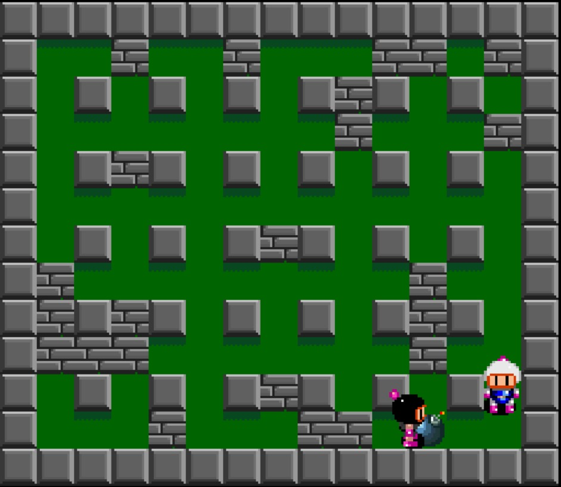

# [BOMBERMAN]

Descrição 
O jogo criado é o bomberman, em que dois players caminham pelo mapa destruindo paredes e obtendo poderes. O objetivo do jogo é explodir o oponente.

Poderes
BOTA - aumenta a velocidade do player
BOMBA - aumenta a quantidade de bombas que o player pode soltar
FOGO - aumenta o raio da bomba

Criação
O jogo foi desenvolvido por Daniel Prado e Diego Yamashitafuji, estudantes de ciência da computação no Insper.
O código foi todo desenvolvido do zero baseado na mecânica do jogo original
Todas as imagens e sprites foram baixadas de diferentes fontes na internet

Instalação
1. Certifique-se de ter o Python instalado no seu computador. Você pode baixá-lo em https://www.python.org/downloads/ 
2. Abra o prompt de comando (no Windows) ou o terminal (no Mac ou Linux)
3. Use o comando "pip install pygame" para instalar a biblioteca Pygame. 
4. Depois de instalar a biblioteca Pygame, baixe o jogo que você deseja jogar e extraia os arquivos para uma pasta no seu computador.
5. Abra o prompt de comando ou o terminal e navegue até a pasta que contém os arquivos do jogo.
Digite o comando "python jogo_bomberman.py"

